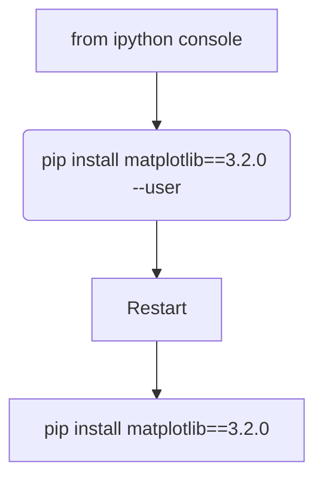
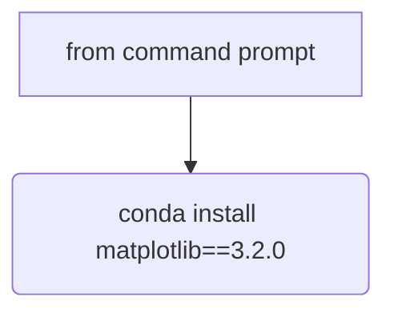

# EMG_EEG_EXO
## Huom!!

Matplotlib 3.3.2 and above versions do not print the figures, since set_xtrick and set_xticklabels are not supported. In order to print images you need to downgrade matplotlib version to 3.2.0

### Function to downgrade matplotlib
from ipython console = pip install matplotlib==3.2.0 --user 

from command prompt  = conda install matplotlib==3.2.0
 

